# Fintech Data Migration Pipeline

An end-to-end **Azure Synapse Analytics** pipeline that migrates fintech data from an **Azure SQL Database** into an **Azure Data Lake Storage Gen2** lakehouse using the **Medallion (Bronze → Silver → Gold)** architecture. The pipeline validates every migrated table, transforms the data with PySpark, builds an analytics-ready star schema in Delta format, and sends a success or failure email when the run finishes.

---

## Table of Contents

- [Architecture](#architecture)
- [Tech Stack](#tech-stack)
- [Repository Structure](#repository-structure)
- [Source Data](#source-data)
- [Pipeline Walkthrough](#pipeline-walkthrough)
- [Data Layers](#data-layers)
- [Prerequisites](#prerequisites)
- [Setup](#setup)
- [Running the Pipeline](#running-the-pipeline)
- [Notifications](#notifications)
- [Security Notes](#security-notes)
- [Possible Improvements](#possible-improvements)
- [Author](#author)

---

## Architecture


**Pipeline overview**

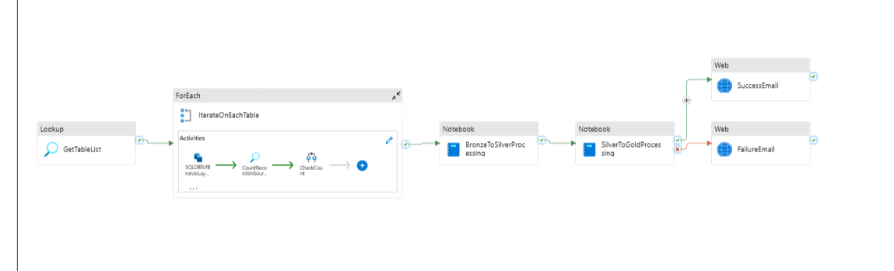

**Storage layers in the data lake**

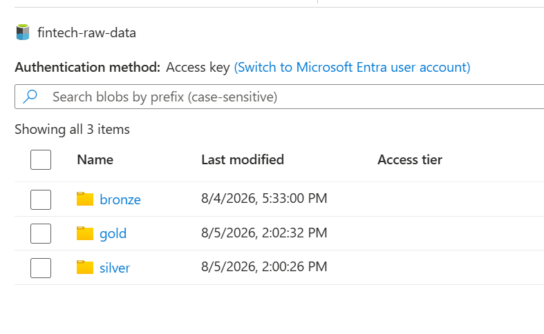

---

## Tech Stack

| Area | Technology |
|---|---|
| Orchestration | Azure Synapse Analytics Pipelines |
| Source | Azure SQL Database |
| Storage | Azure Data Lake Storage Gen2 |
| Transformation | Apache Spark (Synapse Spark pool, PySpark) |
| Table format | Parquet (Bronze), Delta Lake (Silver and Gold) |
| Validation | Synapse serverless SQL pool (`OPENROWSET`) |
| Alerts | Azure Logic Apps (HTTP trigger → Outlook email) |
| Authentication | Managed identity (workspace system identity) |

---

## Repository Structure

This repository is a Synapse workspace exported through Git integration. Each folder maps to a Synapse artifact type.

| Folder | Contents |
|---|---|
| `pipeline/` | `FinTechProjectPipeline` – the main orchestration pipeline |
| `notebook/` | `BronzeToSilverProcess` and `SilverToGlodProcess` PySpark notebooks |
| `sqlscript/` | `ExternalLocationSetupSQL` – one-time serverless SQL setup |
| `dataset/` | `New_SQLSourceTables` (SQL source), `New_BronzeLayerData` (parameterised Parquet sink) |
| `linkedService/` | Connections to Azure SQL DB, ADLS Gen2 accounts, and Synapse serverless SQL |
| `integrationRuntime/` | `AutoResolveIntegrationRuntime` (managed) |
| `credential/` | `WorkspaceSystemIdentity` (managed identity) |
| `assets/` | Screenshots and diagrams used in this documentation |

---

## Source Data

The pipeline reads every base table in the `fintech` schema of the `fintech-db` database:

| Table | Description |
|---|---|
| `Customers` | Customer profile and contact details, signup date |
| `Accounts` | Customer accounts, type, balance, open date |
| `Loans` | Loan type, amount, interest rate, start and end dates |
| `Transactions` | Account transactions (deposits, withdrawals, transfers, fees) |
| `Payments` | Loan payments with method and amount |

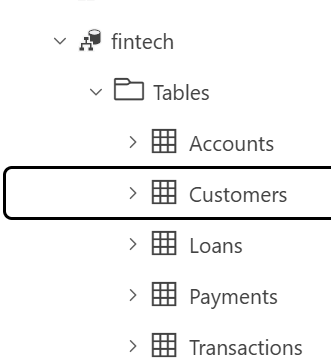

The table list is discovered at runtime with a query on `INFORMATION_SCHEMA.TABLES`, so tables added to the schema are picked up by the Bronze copy step automatically. The Silver notebook, however, currently processes the five tables above explicitly.

---

## Pipeline Walkthrough

The `FinTechProjectPipeline` runs these activities in order:

| # | Activity | Type | What it does |
|---|---|---|---|
| 1 | `GetTableList` | Lookup | Lists all base tables in the `fintech` schema of the source database |
| 2 | `IterateOnEachTable` | ForEach | Loops over each table and runs the three steps below |
| 2a | `SQLDBTofBronzeLayerCopy` | Copy | Runs `SELECT *` on the table and writes Snappy-compressed Parquet to the Bronze layer |
| 2b | `CountRecordsInSourceTable` | Lookup | Counts rows in the source table |
| 2c | `CountRecordsFromBronzeLayerTable` | Script | Counts rows in the Bronze Parquet files via serverless SQL `OPENROWSET` |
| 2d | `CheckCount` | If Condition | Compares both counts. If they differ, a `Fail` activity stops the pipeline with the message *"SQL Source table does not match with Bronze layer data"* |
| 3 | `BronzeToSilverProcessing` | Synapse Notebook | Cleans, standardises, and enriches data into Delta tables |
| 4 | `SilverToGoldProcessing` | Synapse Notebook | Builds dimensions, facts, aggregates, and a date dimension |
| 5 | `SuccessEmail` / `FailureEmail` | Web | Calls a Logic App to email the outcome |

### Step 1: Copy each table to Bronze

The Copy activity is created once and reused for every table. The sink dataset `New_BronzeLayerData` takes two parameters, `tablename` and `schemaname`, filled from the current ForEach item.


The sink dataset builds the output path dynamically (`fintech-raw-data/bronze/fintech/<table>/<table>.parquet`) and compresses with Snappy.


### Step 2: Validate row counts

Two counts are compared for every table: one from the source SQL table and one from the Bronze Parquet files.

Source count (Lookup activity):


Bronze count (Script activity on the serverless SQL linked service):


### Step 3: Run the Spark notebooks

Both notebooks run on the Spark pool `sparkpool` with a small driver and small executors (4 vCores, 28 GB memory each).


### Compute: integration runtime

All activities use `AutoResolveIntegrationRuntime`. Its data flow runtime uses Basic (General Purpose) compute with 4 cores plus 4 driver cores and a time to live of 0 minutes.

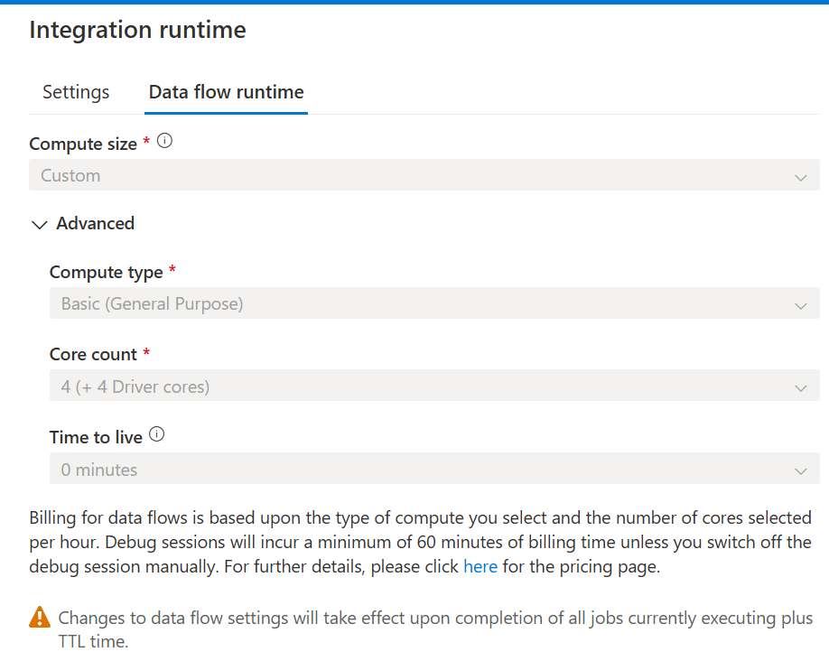

---

## Data Layers

All layers live in the `fintech-raw-data` container of the `fintechrawdata` storage account.

```
fintech-raw-data/
├── bronze/fintech/<Table>/<Table>.parquet
├── silver/fintech/<Table>/            (Delta)
└── gold/fintech/<dataset>/            (Delta)
```

### Bronze – raw copy

A faithful copy of each source table in Parquet (Snappy). No transformations are applied, so Bronze always mirrors the source at the time of the run.

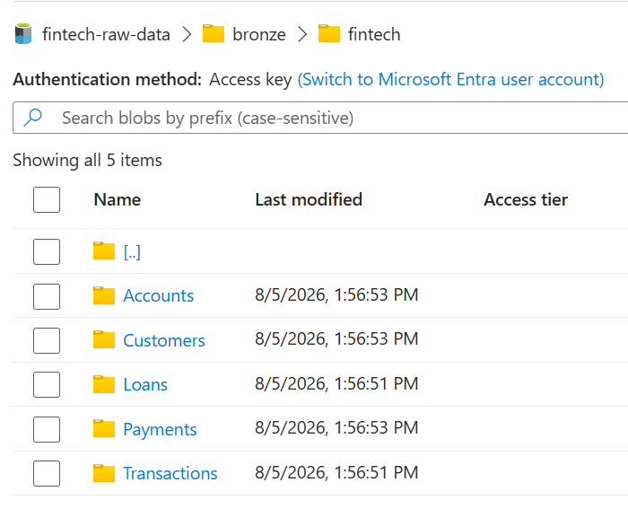

Each table folder holds a single Parquet file, for example `Accounts.parquet`:

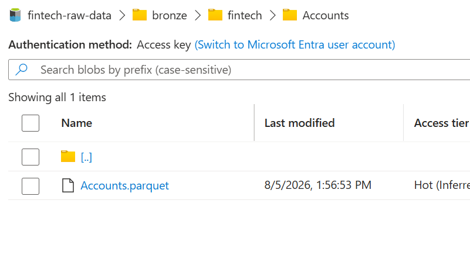

### Silver – cleaned and enriched

`BronzeToSilverProcess` standardises values, applies basic business rules, logs data-quality metrics, and writes Delta tables (overwrite mode).

| Table | Cleaning | Derived columns |
|---|---|---|
| **Customers** | Trims and title-cases names, lower-cases email, standardises city, state, country | `FullName`, `CustomerAge`, `CustomerSegment`, `CustomerTier`, `MaskedEmail` |
| **Accounts** | Normalises account types (e.g. `Saving` → `Savings`); negative balances set to 0 | `AccountAgeYears`, `AccountStatus`, `AccountTier`, `MonthlyInterest`, `IsHighValue` |
| **Loans** | Normalises loan types; non-positive amounts set to 1000; interest rate clamped to 0–30 | `LoanDurationYears`, `TotalInterest`, `MonthlyPayment`, `LoanStatus`, `RiskCategory`, `LoanToValueRatio`, `IsHighRisk` |
| **Transactions** | Normalises transaction types; non-positive amounts set to 0.01 | `TransactionCategory`, `TransactionSize`, day, month, year, `IsWeekend`, `IsLargeTransaction` |
| **Payments** | Normalises payment methods; non-positive amounts set to 0.01 | `DaysSinceLastPayment`, `PaymentSize`, `PaymentMethodCategory`, `IsLatePayment`, `IsLargePayment` |

Data-quality checks log warnings for a low completeness score (`CustomerID` nulls, threshold 95%), invalid email formats, and loans whose start date is not before their end date.

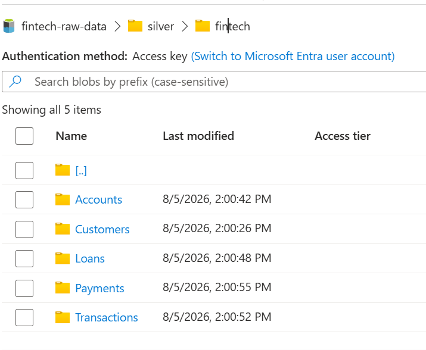

Each Silver table is a Delta table, so it contains a `_delta_log` folder next to its data files:

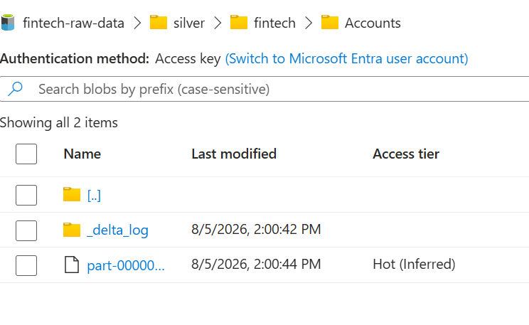

### Gold – analytics-ready star schema

`SilverToGlodProcess` builds the reporting layer.

| Type | Tables |
|---|---|
| **Dimensions** | `dim_customers`, `dim_accounts`, `dim_loans`, `dim_time` |
| **Facts** | `fact_transactions`, `fact_payments`, `fact_customer_accounts` |
| **Aggregates** | `agg_customer_summary`, `agg_account_summary`, `agg_loan_summary` |

Every Gold table includes an `etl_timestamp`. `dim_time` covers 2023-01-01 to 2025-12-31 and includes year, quarter, month, week, day name, weekend flag, and season.

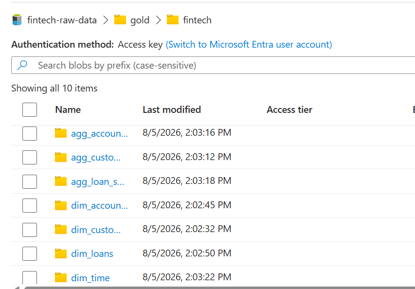

---

## Prerequisites

- An Azure subscription
- An **Azure Synapse Analytics workspace** with:
  - A **Spark pool** named `sparkpool`
  - The built-in **serverless SQL pool**
- An **Azure SQL Database** with a `fintech` schema containing the five tables above
- An **ADLS Gen2 storage account** with a `fintech-raw-data` container
- An **Azure Logic App** with an HTTP request trigger that sends email (for notifications)
- Role assignments for the Synapse workspace managed identity:
  - **Storage Blob Data Contributor** on the storage account
  - Read access (e.g. `db_datareader`) on the Azure SQL database
- Network access: on the SQL server, enable **Allow Azure services and resources to access this server** (and add your client IP if you query it from your machine)

Storage role assignment for the workspace managed identity:

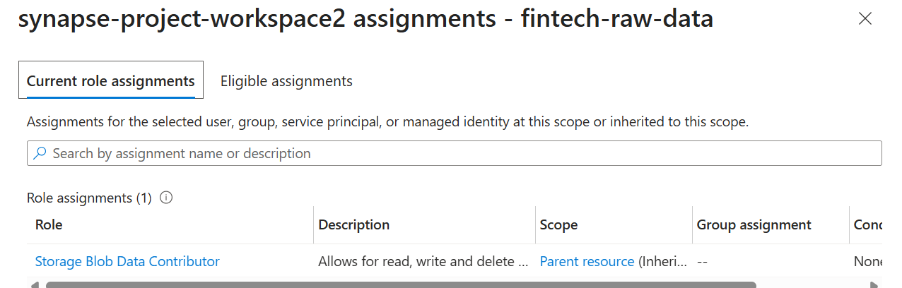

SQL server network settings:

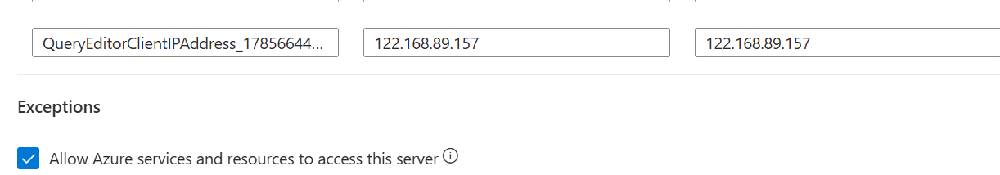

---

## Setup

1. **Clone the repository** and connect it to your Synapse workspace  
   *Synapse Studio → Manage → Git configuration → GitHub*, then select this repo and the `main` branch.

2. **Update the linked services** in `linkedService/` for your environment.

   | Linked service | Update |
   |---|---|
   | `SQLDBConn` | Azure SQL server and database name (system-assigned managed identity) |
   | `TargetADLS` | Your ADLS Gen2 URL (Bronze, Silver, and Gold storage; managed identity) |
   | `SynapseSErverless` | Your workspace serverless SQL endpoint and database (`ReadExternalDataDB`) |

   Source database (Azure SQL):

   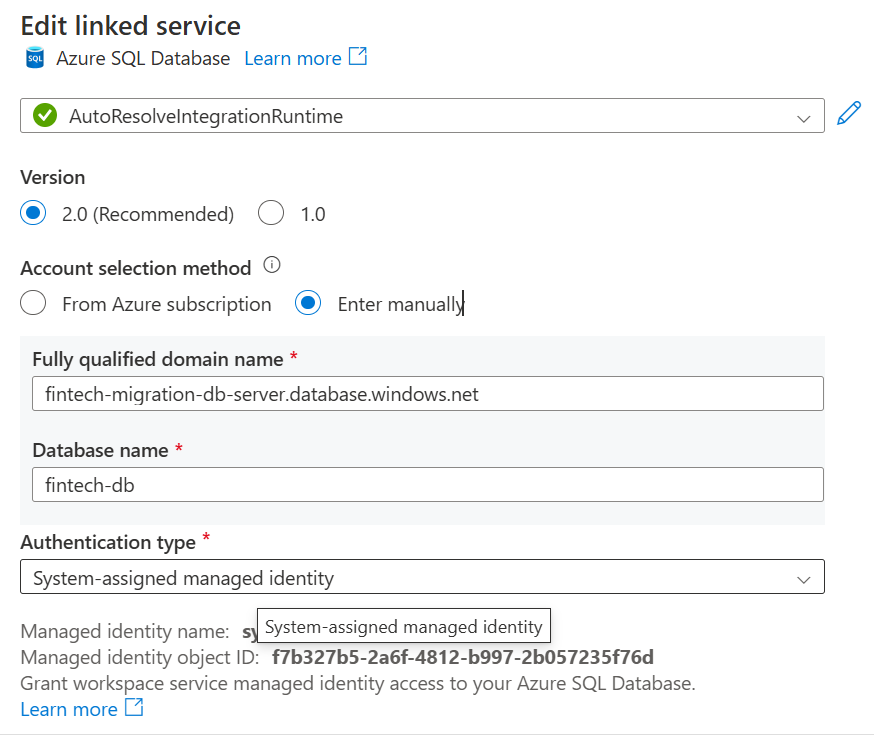

   Target data lake (ADLS Gen2):

   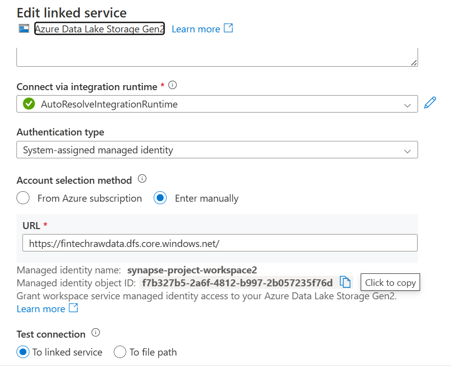

   Serverless SQL pool, used for the Bronze row-count validation:

   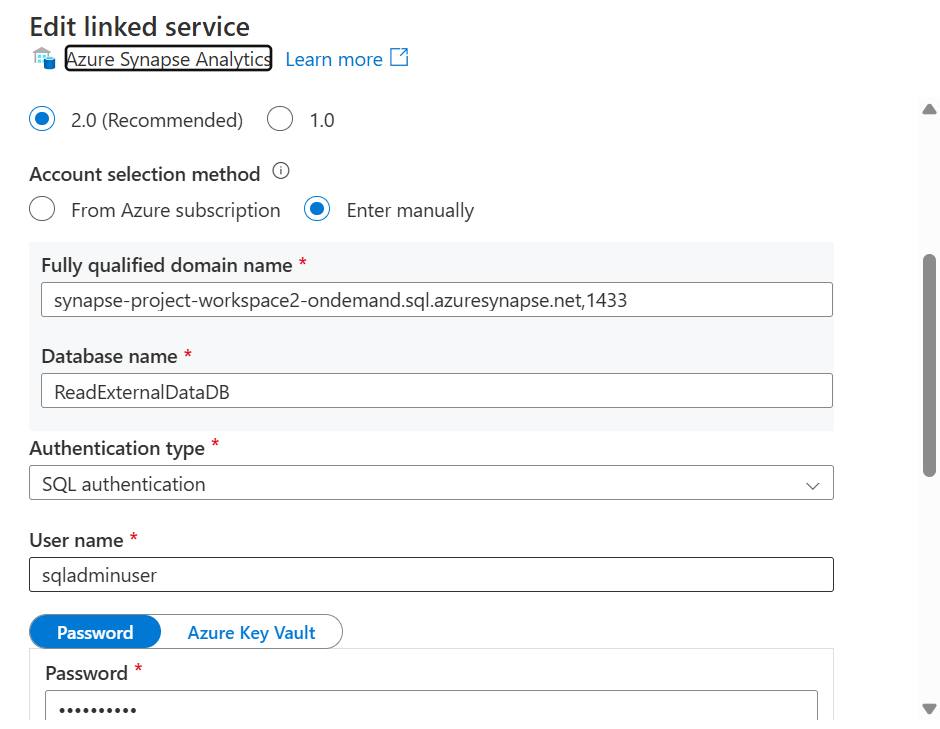

3. **Grant the managed identity access to the source database** (run in the Azure SQL database):

   ```sql
   CREATE USER [<your-synapse-workspace-name>] FROM EXTERNAL PROVIDER;
   ALTER ROLE db_datareader ADD MEMBER [<your-synapse-workspace-name>];
   ```

4. **Run the serverless SQL setup script**, `sqlscript/ExternalLocationSetupSQL`. It creates the `ReadExternalDataDB` database, a scoped credential using the workspace managed identity, and the external data source `FintechDataExternal`, which the pipeline's validation step uses to read Bronze Parquet files.

   > Replace the placeholder master-key password in the script with your own strong password before running it.

5. **Update the storage paths** in both notebooks if your storage account or container name differs from `fintechrawdata` / `fintech-raw-data`.

6. **Create the Logic App** and put its HTTP trigger URL in the `SuccessEmail` and `FailureEmail` Web activities (see [Notifications](#notifications)).

7. **Publish** all changes in Synapse Studio.

---

## Running the Pipeline

1. Open **Synapse Studio → Integrate → `FinTechProjectPipeline`**.
2. Optionally override the parameters:

   | Parameter | Purpose |
   |---|---|
   | `to` | Recipient email address for notifications |
   | `subjectForSuccess` / `EmailMessageSuccess` | Subject and body of the success email |
   | `subjectForFailure` / `EmailMessageFailure` | Subject and body of the failure email |

3. Click **Add trigger → Trigger now** (or add a schedule trigger for recurring loads).
4. Track progress in **Monitor → Pipeline runs**.

**Verifying the output**

- Bronze: `bronze/fintech/<Table>/<Table>.parquet` exists for each table.
- Silver and Gold: each folder contains Delta data and a `_delta_log`.

---

## Notifications

The final two activities call an Azure Logic App through an HTTP POST. The Logic App has an HTTP request trigger followed by an Outlook **Send an email (V2)** action.

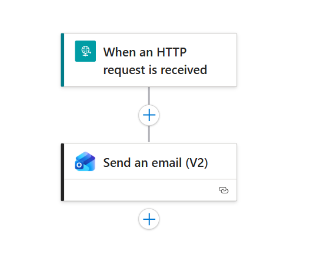

Request body sent by the pipeline:

```json
{
  "to": "<recipient>",
  "subject": "<subject>",
  "emailmsg": "<message>"
}
```

- `SuccessEmail` runs when `SilverToGoldProcessing` succeeds.
- `FailureEmail` runs when `SilverToGoldProcessing` fails.

Success email Web activity:


The body is built from pipeline parameters, as shown here for the failure email:


---

## Security Notes

- The source database (`SQLDBConn`) and the data lake (`TargetADLS`) use the workspace **managed identity**, so no passwords are stored for them.
- The serverless SQL linked service (`SynapseSErverless`) uses **SQL authentication**. Move its password to **Azure Key Vault**, or switch it to managed identity.
- The Logic App trigger URL contains a signature (`sig=`) that acts as a secret. Store it in Key Vault (or a pipeline parameter) instead of committing it, and **regenerate it** if it has ever been published.
- Never commit passwords, keys, or connection strings. Use Key Vault references in linked services.
- Don't publish screenshots that show your public IP address or other identifiers.
- `MaskedEmail` is created in Silver, but Gold still carries the raw `email` column. Restrict access to Gold or drop the raw column for downstream consumers.

---

## Possible Improvements

- Process Silver tables dynamically from the table list instead of hard-coding the five tables.
- Switch from full overwrites to **incremental loads** (watermark column or Delta `MERGE`).
- Add retries on the Copy activity and alerting on data-quality warnings.
- Replace the `CheckCount` count comparison with checksum or column-level reconciliation.
- Extend `dim_time` beyond 2025-12-31.
- Add CI/CD (GitHub Actions) to deploy the workspace to test and production environments.

---

## Author

**Ipsita Sarkar** – [@ipsitasarkar-dev](https://github.com/ipsitasarkar-dev)
